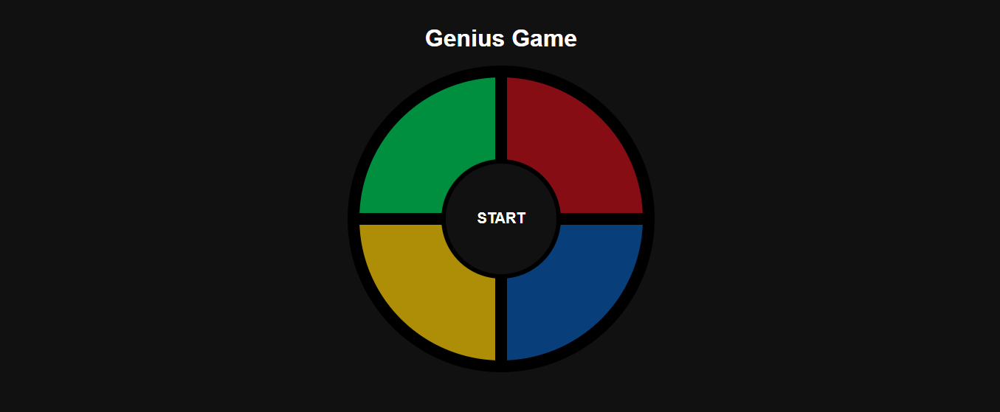

# 🎮 Genius Game

Projeto desenvolvido como desafio acadêmico da plataforma Digital Innovation One (DIO).

---

## 📸 Preview



---

## 📚 Sobre o Projeto

Este projeto consiste na criação de um jogo de memória inspirado no clássico Genius (Simon Game), utilizando apenas:

- HTML
- CSS
- JavaScript

O objetivo do jogo é reproduzir corretamente a sequência de cores gerada automaticamente pelo sistema. A cada rodada, a sequência aumenta, tornando o jogo progressivamente mais desafiador.

---

## 🚀 Conceitos Aplicados

- Estruturação com HTML
- Layout com CSS Grid
- Manipulação de Arrays
- Arrow Functions
- Manipulação de DOM
- Eventos de clique
- Controle de fluxo e lógica de jogo

---

## 🛠 Tecnologias Utilizadas

- JavaScript
- HTML5
- CSS3

---

## ▶️ Como Executar

1. Clone o repositório:

   ```bash
   git clone https://github.com/caxiano/genius-game.git
   ```

2. Navegue até a pasta do projeto:

   ```bash
   cd genius-game
   ```

3. Abra o arquivo <code>index.html</code> no navegador.

---

## 📌 Status do Projeto

✔ Concluído

✔ Funcional

✔ Versão acadêmica

---

## 👨‍💻 Autor

Desenvolvido por Cassiano Nishikawa

GitHub: <a href="https://github.com/caxiano">https://github.com/caxiano</a>
